# HackTheOcean

## Back-End OceanX

A continuación, se presenta el API realizado para conectar la página de [OceanX](https://armvasquez.github.io/HackTheOcean---OceanX/index.html).

## Front-End

[Link repositorio Front-End](https://github.com/RodolfoMorquecho/HackTheOcean).

## Herramientas

- NodeJS
- Sequelize ORM
- MySQL
- MySQL Workbench

## Modelo de Base de Datos

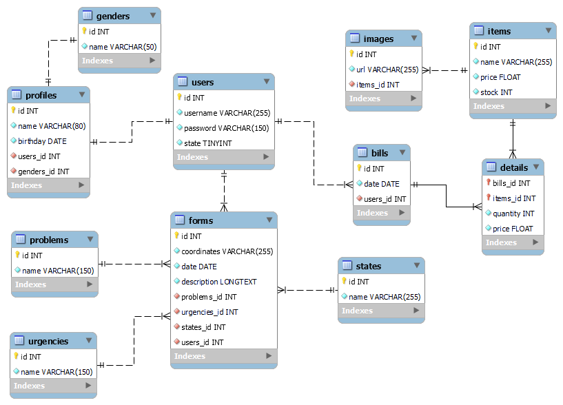
Modelo base de datos OceanX

## Capturas

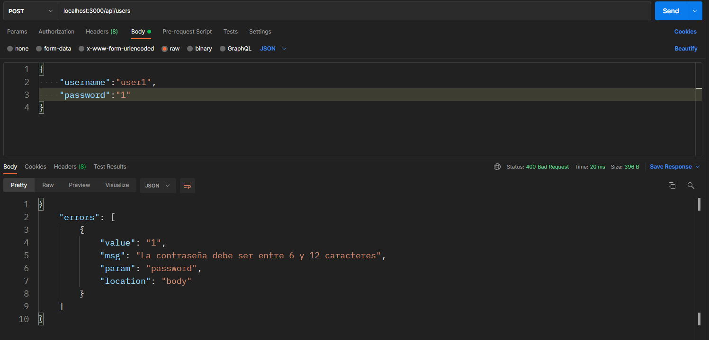
Validación de registro de usuario

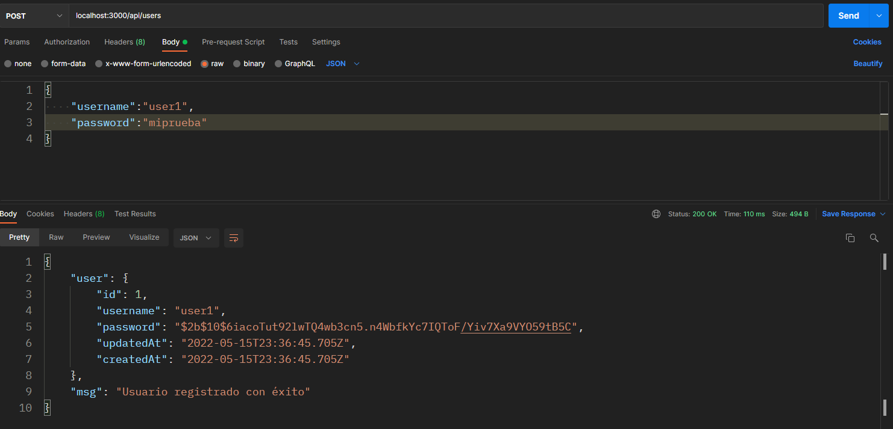
Registro de usuario exitoso I

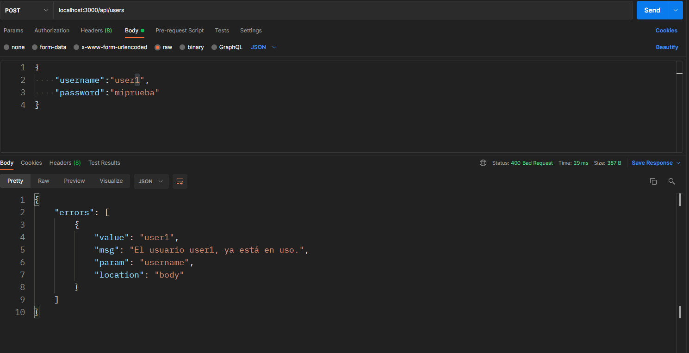
Validación de usuario existente

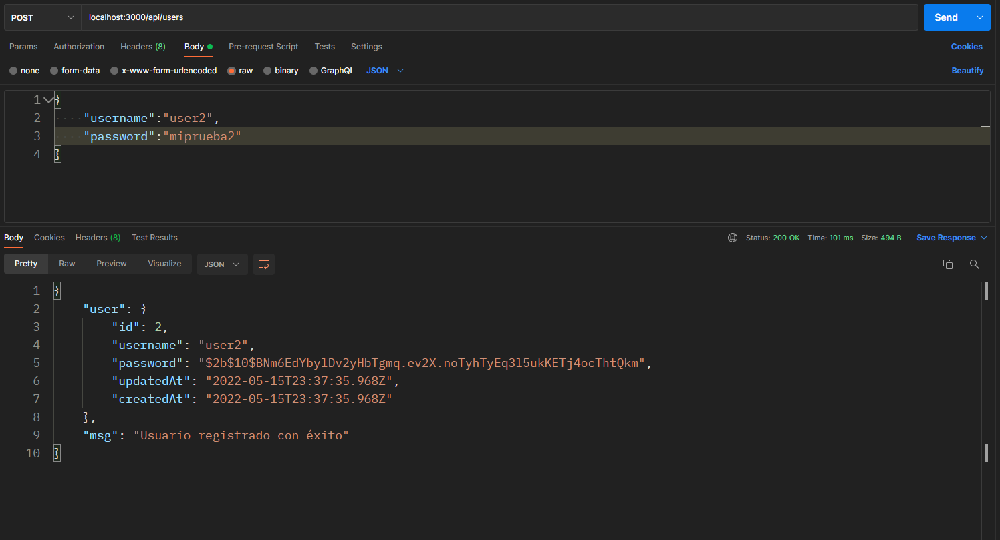
Registro de usuario exitoso II

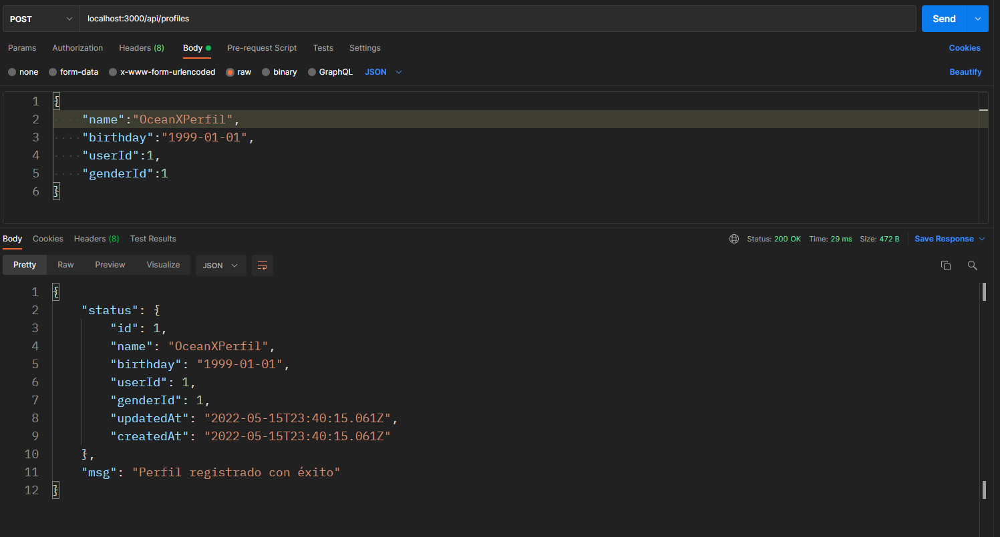
Registro de perfil exitoso I

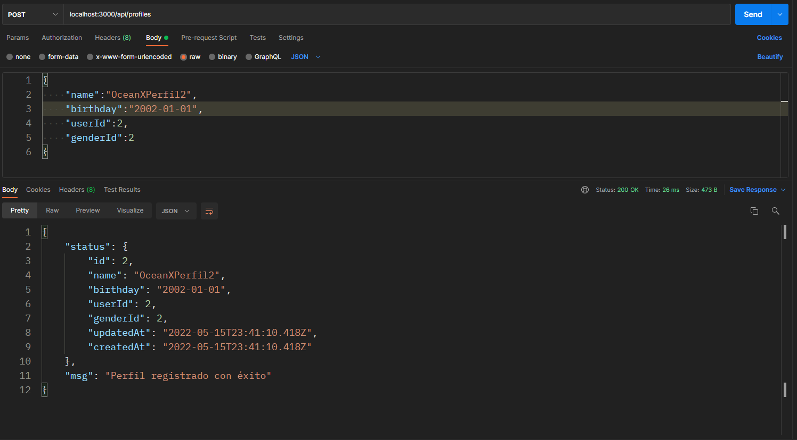
Registro de perfil exitoso II

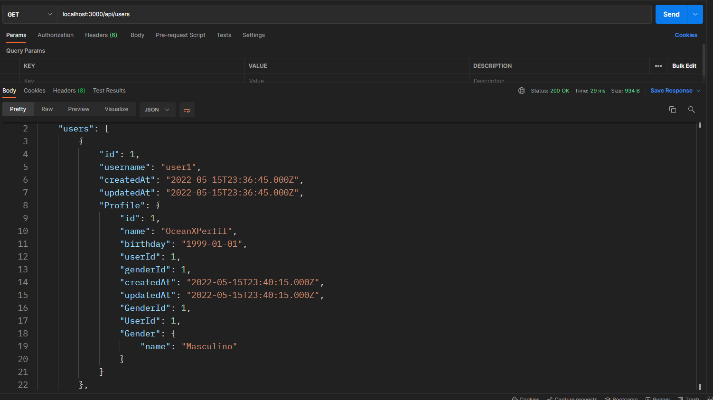
Lista de usuarios

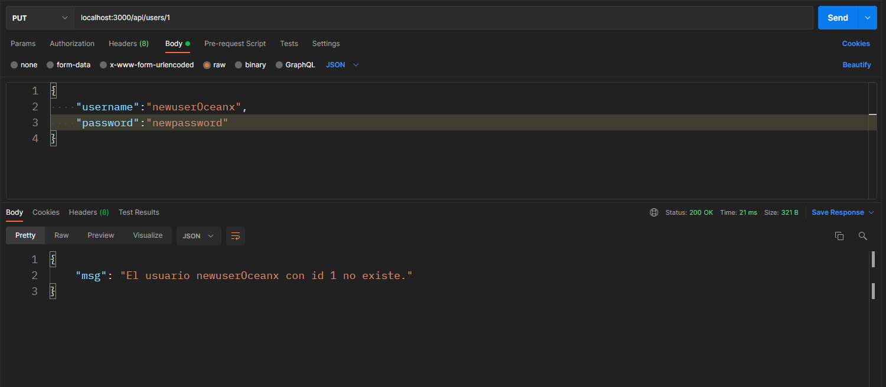
Validar actualización contraseña de usuario

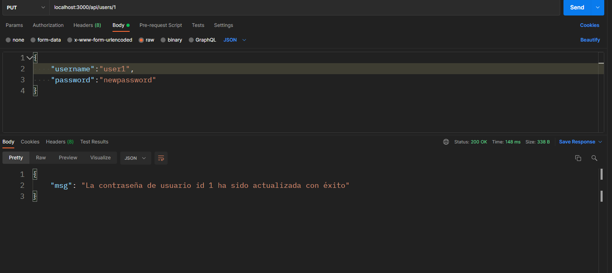
Actualización contraseña de usuario

Validar eliminar usuario

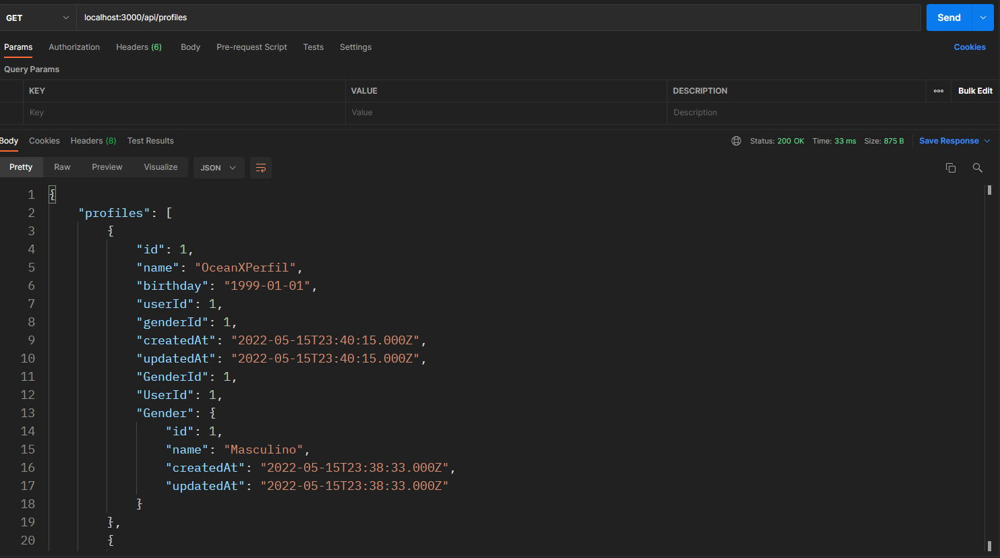
Lista de perfiles

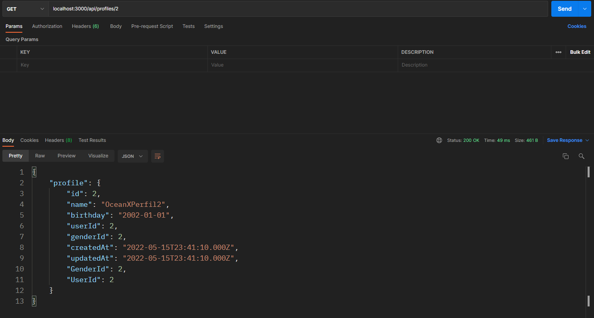
Obtener un perfil específico

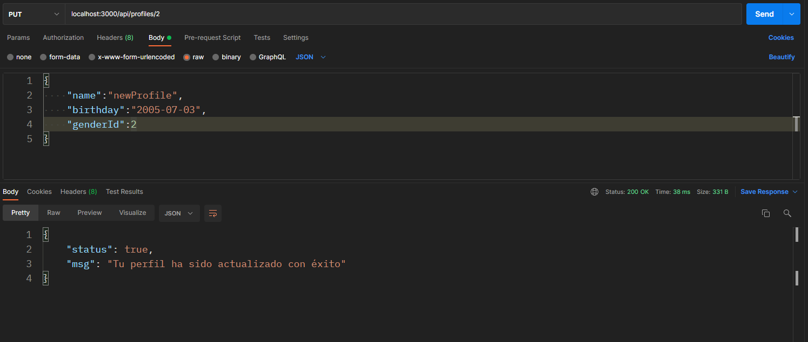
Actualización de perfil de usuario

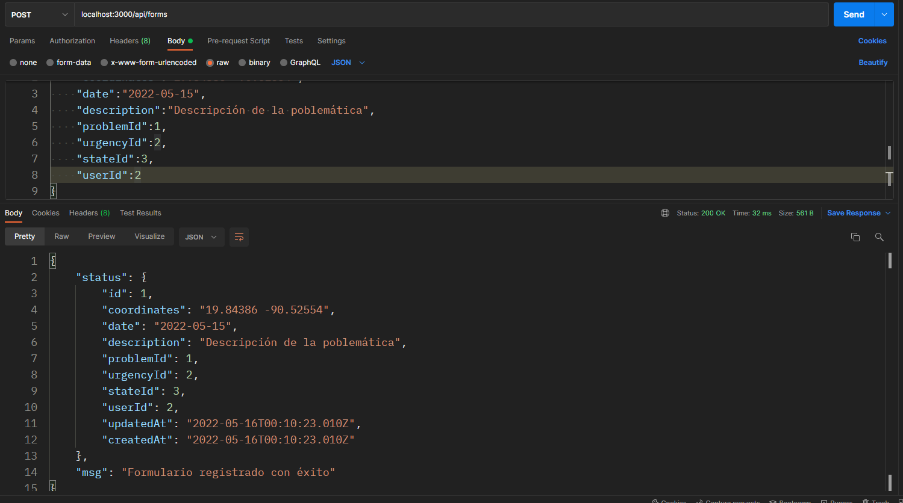
Registrar formulario

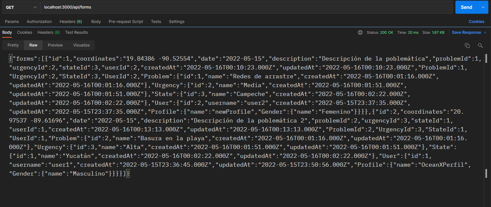
Listar formularios registrados

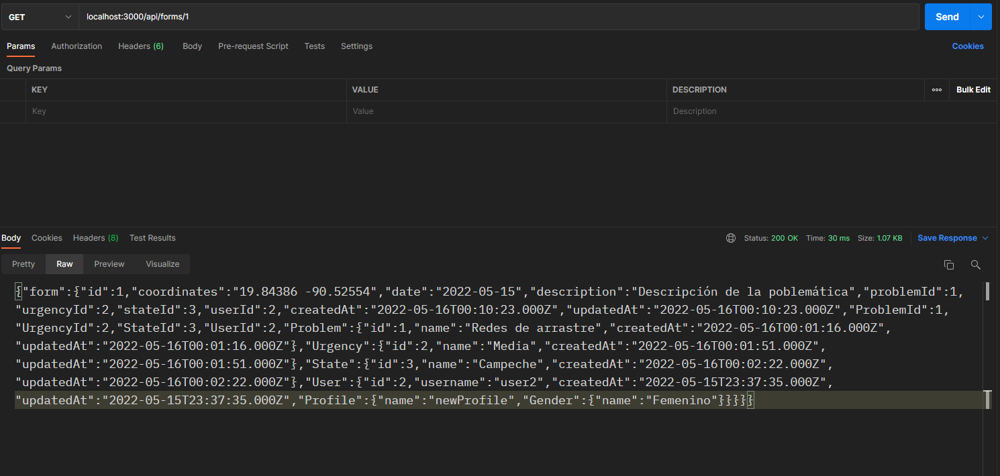
Listar formulario en específico

## Créditos

[Brhayan Ramos Gamboa](https://github.com/BrhayanRamosG)

[Armando Vasquez Ambrocio](https://github.com/ArmVasquez)

[Sandra Fabiola Morales Mateos](https://github.com/FabiMateosCat)

[Omar Alejandro Trujillo](https://github.com/MazinoXX)

[Rodolfo Ivan Morquecho](https://github.com/RodolfoMorquecho)
